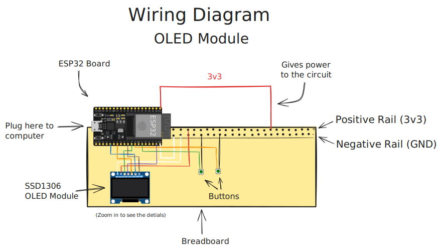
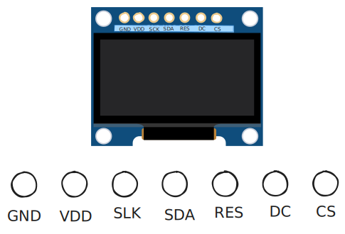
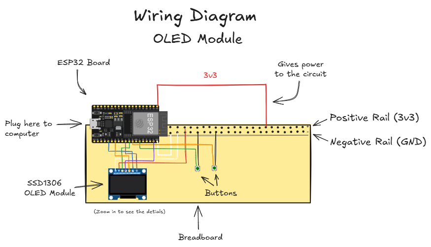
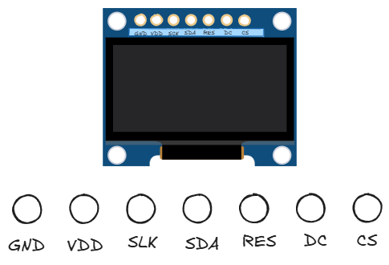

# 7 pins OLED Screen Configuration

This is the just 'How to do it on your own' guide. The codes are simply in this repo which you can simply just use to upload immediately if you already have everything setup!

---
# 1. Connect the Wires
### Wiring Diagram

<<<<<<< HEAD


=======


>>>>>>> 7a30c557ec1ca556d37a2242426cbb332b6b3f20

(Open the `Setup.md` in Obsidian and Double click on the image to interact)

```
GND --> GND Rail
VDD --> 3v3 Rail
SLK --> G18
SDA --> G23
RES --> G4
DC --> G2
CS --> G5
```

## Key-term Similarities
- VDD = 3v3 or 5V (use 3v3 to be safe)
- GND = Ground
- SDA = MOSI
- SLK = CLK
---
# 2. OLED Configuration
The libraries we need for connection:

```cpp
#include <SPI.h>
#include <Wire.h>
#include <Adafruit_GFX.h> //graphic libraries
#include <Adafruit_SSD1306.h> //matches the 7 pin OLED module
#include <FluxGarage_RoboEyes.h> // Robot eyes library
```

Because there are 7 pins on SSD1306 OLED Module, we define them this way.
Paste this under the library imports:
```cpp
#define SCREEN_WIDTH 128
#define SCREEN_HEIGHT 64
#define OLED_MOSI   23
#define OLED_CLK    18
#define OLED_DC     2
#define OLED_CS     5
#define OLED_RESET  4
```

- `Screen Width`: 128px
- `Screen Height`: 64px
- `MOSI`: This is the main data line. The ESP32 (Master) sends the actual pixel data and commands to the OLED (Slave) through this pin.
- `CLOCK, SCK or CLK`: This provides the "heartbeat" or timing signal. It ensures the OLED reads the data from the MOSI pin at exactly the right moment.
- `OLED_DC 2 (Data/Command)`: This tells the screen if the incoming data is a **Command** (like "turn on" or "clear screen") or **Data** (like "draw a pixel here").
- `OLED_RESET`: resets the OLED module.


# Add this function for the screen
place this function underneath the codes above to configure the screen display.
```cpp
Adafruit_SSD1306 display(SCREEN_WIDTH, SCREEN_HEIGHT, OLED_MOSI, OLED_CLK, OLED_DC, OLED_RESET, OLED_CS);// This is important for the screen to work

RoboEyes<Adafruit_SSD1306> roboEyes(display); //this for the Robot eyes only. Don't worry about it.
```

---
# 3. Buttons Configuration

If you have a few buttons you want to connect, you can do so by configuring them like this:

```
#define (to create a constant) --> <Variable name> --> pin number
```
Now it should be placed underneath the rest of the other constants. The code should look something like this:

```cpp
// #define SCREEN_WIDTH 128
// #define SCREEN_HEIGHT 64
// #define OLED_MOSI   23
// #define OLED_CLK    18
// #define OLED_DC     2
// #define OLED_CS     5
// #define OLED_RESET  4

//Button down here
#define BUTTON_1 19 // This button is connected to digital pin 19
#define BUTTON_2 21 // This button is connected to digital pin 21
```

# 4. Setup your ESP32
- Plug in the ESP32 to your computer
- Open 'Arduino IDE' --> New Sketch or Open Sketch
- Open one on the `.ino` files above or paste them in
- When finished --> Upload
- Your ESP32 should display correctly


